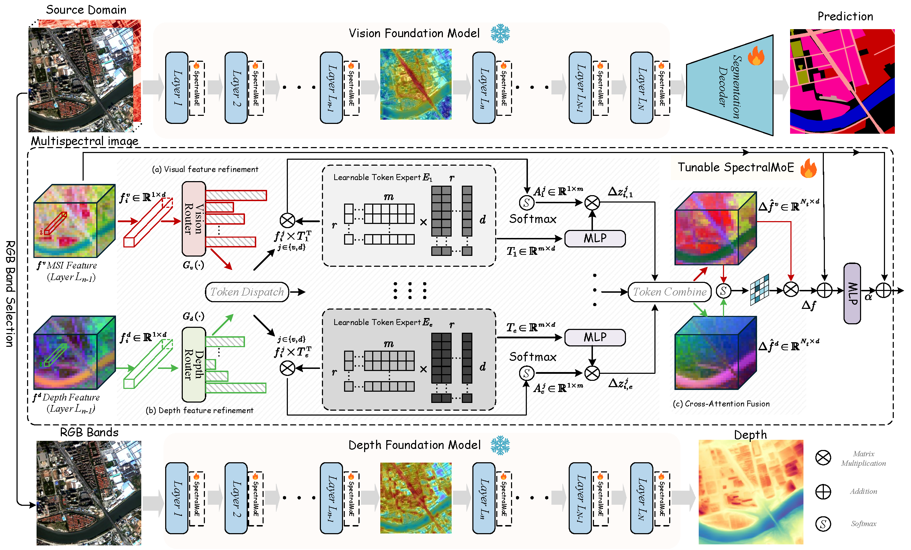

# Local Precise Refinement: A Dual-Gated Mixture-of-Experts for Enhancing Foundation Model Generalization against Spectral Shifts

**SpectralMoE** is inserted as a lightweight plugin into each layer of frozen VFMs and DFMs. At its core is a \textbf{dual-gated MoE} mechanism. A dual-gated network independently routes visual and depth feature tokens to specialized experts, enabling fine-grained, spatially-adaptive adjustments that overcome the limitations of global, homogeneous methods. Following this expert-based refinement, a \textbf{Cross-Attention Fusion Module} adaptively injects the robust spatial structural information from the adjusted depth features into the visual features. This fusion process effectively mitigates semantic ambiguity caused by spectral shifts, significantly enhancing the model's cross-domain generalization capability.
