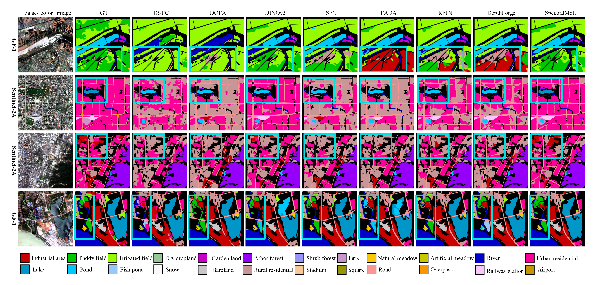

# Local Precise Refinement: A Dual-Gated Mixture-of-Experts for Enhancing Foundation Model Generalization against Spectral Shifts


**SpectralMoE is inserted as a lightweight plugin into each layer of frozen VFMs and DFMs.** At its core is a dual-gated MoE mechanism. A dual-gated network independently routes visual and depth feature tokens to specialized experts, enabling fine-grained, spatially-adaptive adjustments that overcome the limitations of global, homogeneous methods. Following this expert-based refinement, a Cross-Attention Fusion Module adaptively injects the robust spatial structural information from the adjusted depth features into the visual features. This fusion process effectively mitigates semantic ambiguity caused by spectral shifts, significantly enhancing the model's cross-domain generalization capability.

# Cross-Sensor and Cross-Geospatial Generalization Tasks
Our experiments establish **cross-sensor** and **cross-geospatial** generalization tasks based on GF-2 MSIs from the [Five-Billion-Pixels dataset](https://x-ytong.github.io/project/Five-Billion-Pixels.html). For the cross-sensor task, these GF-2 MSIs serve as the source domain, while MSIs from [GF-1, PlanetScope, and Sentinel-2](https://drive.google.com/drive/folders/192UybJ9xDZcaxWnYQchUc5QhlVq51oL9) form the target domains. For the cross-geospatial task, we partition the GF-2 MSIs within the [Five-Billion-Pixels dataset](https://drive.google.com/drive/folders/1924VnO08Gqo3Nv7Y4KirgJ9kqqCup7f0) into geographically disjoint source domain and target domain.

**Subfigure (a)** presents the domain distribution for the cross-sensor task, where locations corresponding to the source domain (GF-2 imagery) are marked by blue solid circles, and those corresponding to the target domains (PlanetScope, GF-1, and Sentinel-2 imagery) are indicated by red circles. **Subfigure (b)** illustrates the domain distribution for the cross-geospatial task, with blue solid circles representing the source domain (GF-2 imagery from various regions) and red solid circles denoting the target domain (GF-2 imagery from designated cities).

# Visualization
* **Qualitative results for cross-sensor multispectral DGSS task.** Comparative visualization of land cover classification from the [DSTC](https://link.springer.com/chapter/10.1007/978-3-031-72754-2_21), frozen RSFM + Mask2Former decoder ([SoftCon](https://ieeexplore.ieee.org/abstract/document/10726860), [Galileo](https://arxiv.org/abs/2502.09356), [SenPaMAE](https://link.springer.com/chapter/10.1007/978-3-031-85187-2_20), [Copernicus](https://openaccess.thecvf.com/content/ICCV2025/supplemental/Wang_Towards_a_Unified_ICCV_2025_supplemental.pdf), [DOFA](https://arxiv.org/abs/2403.15356)), frozen VFM + Mask2Former decoder ([CLIP](https://proceedings.mlr.press/v139/radford21a), [SAM](https://openaccess.thecvf.com/content/ICCV2023/html/Kirillov_Segment_Anything_ICCV_2023_paper.html), [EVA02](https://openaccess.thecvf.com/content/CVPR2023/html/Fang_EVA_Exploring_the_Limits_of_Masked_Visual_Representation_Learning_at_CVPR_2023_paper.html), [DINOv2](https://arxiv.org/abs/2304.07193),[DINOv3](https://arxiv.org/abs/2508.10104)), FM-based DG semantic segmentation methods ([SET](https://dl.acm.org/doi/abs/10.1145/3664647.3680906), [FADA](https://proceedings.neurips.cc/paper_files/paper/2024/hash/aaf50c91c3fc018f6a476032d02114d9-Abstract-Conference.html), [Rein](https://openaccess.thecvf.com/content/CVPR2024/html/Wei_Stronger_Fewer__Superior_Harnessing_Vision_Foundation_Models_for_Domain_CVPR_2024_paper.html), [DepthForge](https://openaccess.thecvf.com/content/ICCV2025/html/Chen_Stronger_Steadier__Superior_Geometric_Consistency_in_Depth_VFM_Forges_ICCV_2025_paper.html)), and our proposed SpectralMoE. Input MSIs and corresponding ground truth maps are also shown for reference. SpectralMoE exhibits  superior accuracy in challenging cross-sensor scenarios. Please zoom in to the white box region to see more details.


* **Quantitative Results for Cross-Sensor Multispectral DGSS Task**

|Setting |mIoU |Config|Checkpoint|
|-|-|-|-|
|**Cross-sensor task**|**66.19**|[config](https://github.com/daxichen/SpectralMoE-main/blob/main/configs/dinov3/depthmoe_dinov3_mask2former_512x512_bs2x4_gid_k1_Ne6_r16.py)|[checkpoint](https://drive.google.com/file/d/1UrMGcWRQihnPsaZ3Y0fkG_BkbhpK093m/view?usp=sharing)

# Environment Setup
```
conda create -n SpectralMoE python=3.10
conda activate SpectralMoE
conda install pytorch==2.0.1 torchvision==0.15.2 torchaudio==2.0.2 pytorch-cuda=11.8 -c pytorch -c nvidia
pip install -U openmim
mim install mmengine==0.10.7
mim install mmcv==2.0.0
mim install mmdet==3.3.0
mim install mmsegmentation==1.2.2
pip install xformers==0.0.20
pip install pillow==11.1.0
pip install numpy==1.26.3
pip install timm==0.4.12
pip install einops==0.8.0
pip install ftfy==6.3.1
pip install matplotlib==3.10.0
pip install prettytable==3.12.0
pip install GDAL==3.6.1
pip install future tensorboard
```


# Data Processing
The data folder structure should look like this:
```
data
├── GID
│   ├── source_dir
│   │   ├── image
│   │   ├── label
│   ├── target_dir
│   │   ├── image
│   │   ├── label
├── Potsdam2Vaihingen
│   ├── Potsdam
│   |   ├── image
│   │   ├── label
│   ├── Vaihingen
│   |   ├── image
│   |   ├── label
├── ...
```

## Constructing Cross-Sensor Generalization Tasks
* **Remove padding:** This script is designed to remove the "padding" from your GID (Five-Billion-Pixels dataset) images and their corresponding labels. GID images come with extra borders around the actual data, and this script helps you crop them out consistently.
  ```
  python tools\convert_datasets\remove_padding.py
   ```
  **Note: You need to specify your input data paths and the paths for processing output data.**
  
* **Crop GID images and labels:** Crop GF-2 **multispectral images** and **labels** to a size of **512x512**.
  ```
  python tools\convert_datasets\cut_GID.py
  python tools\convert_datasets\cut_GID_label.py
  ```
  **Note: You need to specify your input data paths and the paths for processing output data.**

* **Rename:** Unify the names of labels with their corresponding GF-2 multispectral images.
  ```
  python tools\convert_datasets\rename_gid_label.py
  ```
  **Note: You need to specify your input data paths.**
  
* **Target Domain Data Processing:** Extract **multispectral images** and **labels** from the annotated regions of [five megacities in China](https://drive.google.com/drive/folders/192UybJ9xDZcaxWnYQchUc5QhlVq51oL9) to serve as **target domain data**.
  ```
  python tools\convert_datasets\GID_target_process.py
  ```
  **Note: You need to specify your input data paths and the paths for processing output data.**

  Then, crop the **target domain multispectral images** and their corresponding **labels** to a size of **512x512**.
   ```
  python tools\convert_datasets\cut_GID.py
  python tools\convert_datasets\cut_GID_label.py
  ```
  **Note: You need to specify your input data paths and the paths for processing output data.**

# Ecaluation
* First, download [DINOv2](https://dl.fbaipublicfiles.com/dinov2/dinov2_vitl14/dinov2_vitl14_pretrain.pth) pre-trained weights and process the **Dinov2 Large pre-trained model weights** to adapt them for **four-channel multispectral images**.
```
python tools/convert_models/convert_dinov2.py checkpoints/dinov2_vitl14_pretrain.pth checkpoints/dinov2_converted.pth
```
* Then, perform inference using the trained model.
```
python tools/test.py configs/dinov2/fmolte_dinov2_mask2former_384x384_bs1x8_gid.py checkpoints/cross_sensor_iter_78760.pth --backbone checkpoints/dinov2_converted.pth
```
* Finally, visualize the **land cover classification results**.
```
python tools\visualizesegmentationmap.py
```
**Note: You need to specify your input data paths and the paths for processing output data.**

# Training
* First, download [DINOv2](https://dl.fbaipublicfiles.com/dinov2/dinov2_vitl14/dinov2_vitl14_pretrain.pth) pre-trained weights and process the **Dinov2 Large pre-trained model weights** to adapt them for **four-channel multispectral images**.
```
python tools/convert_models/convert_dinov2.py checkpoints/dinov2_vitl14_pretrain.pth checkpoints/dinov2_converted.pth
```
* Then, begin training.
```
python tools/train.py configs/dinov2/fmolte_dinov2_mask2former_384x384_bs1x8_gid.py 
```

# Acknowledgment
Our implementation is mainly based on following repositories. Thanks for their authors.
